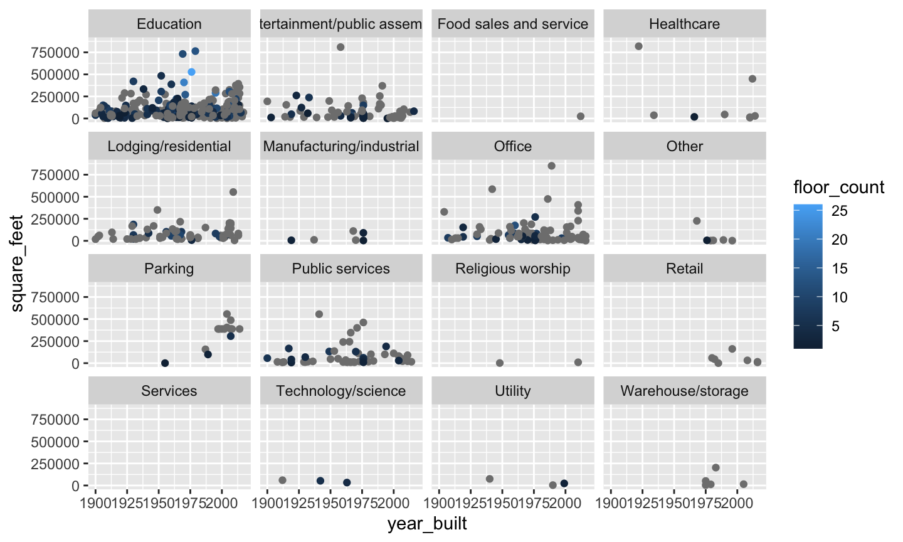

# Sustainable Urbanisation:  Building Energy Consumption Forecast

1. Introduction
2. Data exploration
3. Modelling process
4. Project ways of working
5. Further service opportunities

## Introduction

The project outlined here describes the high level project plan for a new digital service on the sustainable urbanisation business.

The service predicts short-term (up to 7 days) energy demand for industrial business, based on the building characteristics, usage, and weather forecasts.

The service will be consumed by our customers through an API. We might also consider implementing a web-based UI, depending on customer feedback.

# Data exploration

1. Metadata, meter and weather data
2. Imputation and augmentation

## Data exploration: metadata

Notes:

- Missing data points: either a flexible model or imputation will be required
- Unbalanced dataset

Possible imputation:

1. Bin square_feet per primary_use, interpolate floor year_built
2. Bin square_feet and year_built per primary_use, interpolate floor_count
3. Could interpolate from energy usage as well, but not if that will be the predictor

## Data exploration: meter readings

image

Notes:

- No missing data on current dataset, however we still need to protect against missing data for production
- Scales varies significantly: a model that can operate on these conditions is required

Possible augmentation and imputation:

- Past consumption of own building and aggregate neighbourhood (sites) should be evaluated as it could be a good predictor
- Use [STL decomposition](https://www.rdocumentation.org/packages/stats/versions/3.6.2/topics/stl) and input using the interpolation of the seasonal + trend signals
- Use ARIMA to interpolate values (possibly leveraging [Kalman Filter (KF) approach](https://stats.stackexchange.com/questions/104565/how-to-use-auto-arima-to-impute-missing-values))

## Data exploration: weather data

image

Notes:

- Missing data points

Possible augmentation and data imputation:

- Generally weather data can be augmented with engineering variables, lags and moving averages for increased prediction power
- Similar to the meter data, STL decomposition or ARIMA + KF could be used for imputation
- Alternatively, if we have x,y coordinates for the site_id's we could also perform krigging with neighbour sites

# Modelling process

1. Data pre-processing
2. Model development

## Data pre-processing

1. All variables must be converted into their natural types (integer, numeric, categorical, timestamp)
1. Outliers must be detected and treated
2. Imputation is performed - good practice for production applications
3. Variable engineering is performed (such as new calculated variables) in consultation with subject matter experts (SME)
4. Datasets are joined, based on common ids

All steps substantiated with visualisations

## Model development

5. Train/test split is performed (walk-forward cross validation)
5. Due to size of dataset and possible memory constrains it would be economical to evaluate simpler model structures (e.g. polynomials) with full dataset compared with more complex structures being built on a sample of the dataset
6. Given there will be more data coming during the project timeline, setting aside a full-blind dataset is not required
6. Variable importance is assessed (e.g. Boruta algorithm)
7. Model development takes into account out-of-sample (OOS) metrics for benchmarking
8. After model is selected, investigation plots are built (e.g. partial dependence plots, variable importance, etc.) and these are discussed with SME
9. Model OOS metrics threshold is defined with SME, which will be used for continued retraining and evaluation of automated future model quality

# Ways of working

1. Delivery framework
2. Timelines
3. Architecture & controls
4. Operations pipeline

## Delivery framework

- Agile DevOps, minimum 50% allocation for DevOps team members
- DevOps Team with 3 - 4 members, 4 eyes principle on each work package
- Required DevOps team skills: Business/SME, Data Science, MLOps
- Required support team skills: Scrum master/PM, IT Architecture and Information Risk Management (IRM)
- Steering committee should have representatives of all above disciplines
- When integration with external parties is required, those will be managed through SEI's CERT Resilience Management Model - [External Dependencies](https://resources.sei.cmu.edu/library/asset-view.cfm?assetid=514765)

## Timelines

- Sprints aiming at minor releases each sprint.
- First sprint will heavily require business stakeholders and architecture for a design workshop that will follow a layered approach: business requirements followed by translation into high level design and controls' definition (Ops & IRM)
- Aim to deliver working economical solution in 6 + 2 sprints: by sprint 4 timelines will be re-negotiated with steering committee

## Solution architecture & controls

- Cloud tool: Azure Machine Learning (AzureML), which offers a simple data science solution with productisation features
- Environments: Development, Test and Production
- CICD pipelines maintained through GitHub actions
- Data workflow: Data will be sourced appropriately and stored as dataset connections on Azure, without effective interim storage (apart from models)
- Ops & IRM controls will be automatically monitored

## Operations (CICD) pipeline [1 of 2]

- Data tests will be defined and implemented (i.e. pipeline only advances if previous tests have been successful)
- Chosen model metrics will be compared with defined threshold, as a final test
- Successful models will be converted into artefact for deployment
- Deployed artefacts will be exposed as endpoints on AzureML in the test environment, enabling the service to be used as an API (for test)

## Operations (CICD) pipeline [2 of 2]

- Service is tested with several test datasets (engineered to break functionalities) in an automated fashion, and results are collected
- DevOps team member will look at new model test results and compare with current production model results, optionally promotion of new model to production environment will happen.
- Model decay will be monitored and DevOps team will be notified when a significant improvement can be achieved by promoting a new model from test to production
- When model decay can not be treated with an available model on the test environment,  DevOps team will be notified to act

## Further service opportunities

- With enough data gathered, by accessing energy price data, the service could be extended to predict local energy price
- Additional short term service: With energy price prediction, the service could send signal to automatically dispatch extra cooling/heating, for optimising the total energy cost
- Additional long term service: With long term data collected it is possible to suggest battery stack investments based on minimisation of energy costs in presence of storage